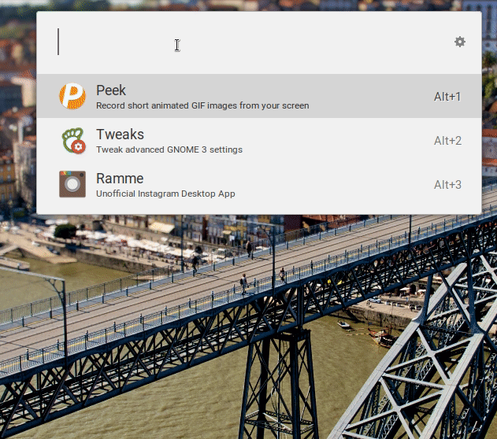

# ulauncher-devdocs

[](https://ext.ulauncher.io/-/github-brpaz-ulauncher-devdocs)
[](https://github.com/brpaz/ulauncher-devdocs/blob/master/LICENSE)

> [Ulauncher](https://ulauncher.io) extension to search documentation on [DevDocs](https://devdocs.io/)

## Demo



## Requirements

- Ulauncher
- Python >= 2.7

## Install

Open ulauncher preferences window -> extensions -> add extension and paste the following url:

```
https://github.com/brpaz/ulauncher-devdocs
```

## Usage

### Basic configuration

The first thing you need to do is to Open Extension preferences and configure the "List of Documentation to Download". The value of this input needs to be a valid JSON array
containing the "slug" of the documentation pages you want to download. You can get the "slug" by opening the desired documentation page in your browser and look at the value in the url.

**Note** This is only for first level documentation.

After configuring your documentation preferences, the extension will start downloading the documentation in background. (it might take some time, depending on the number of documentations to download). You will receive a notification when the index process finish.

You can then start searching Documentation from ulauncher using "docs" keyword.

### Specific keywords.

Instead of using "docs" as keyword for everything, you can specify specific keywords for each programming language. You can configure them in `manifest.json` file.

Ex:

```json
 {
      "id": "ruby",
      "type": "keyword",
      "name": "ruby",
      "default_value": "ruby~2.5"
},
```

**Note** The keyword id and name can be whatever you want, but the default value should match a existing language slug.

### Configure how to open DevDocs

- The default configuration will open the documentation on the default browser. You can change it to open in [Hawkeye](https://github.com/brpaz/hawkeye) or with the custom DevDocs protocol. This will allow opening directly on [DevDocs-desktop](https://github.com/egoist/devdocs-desktop) after this [PR](https://github.com/egoist/devdocs-desktop/pull/79) is merged.

## Development

```
git clone https://github.com/brpaz/ulauncher-devdocs
make link
```

The `make link` command will symlink the cloned repo into the appropriate location on the ulauncher extensions folder.

To see your changes, stop ulauncher and run it from the command line with: `ulauncher -v`.

## Contributing

- Fork it!
- Create your feature branch: git checkout -b my-new-feature
- Commit your changes: git commit -am 'Add some feature'
- Push to the branch: git push origin my-new-feature
- Submit a pull request :D

## Support

If you like my work, you can:

<a href="https://www.buymeacoffee.com/Z1Bu6asGV" target="_blank"></a>

## License

MIT &copy; [Bruno Paz]
